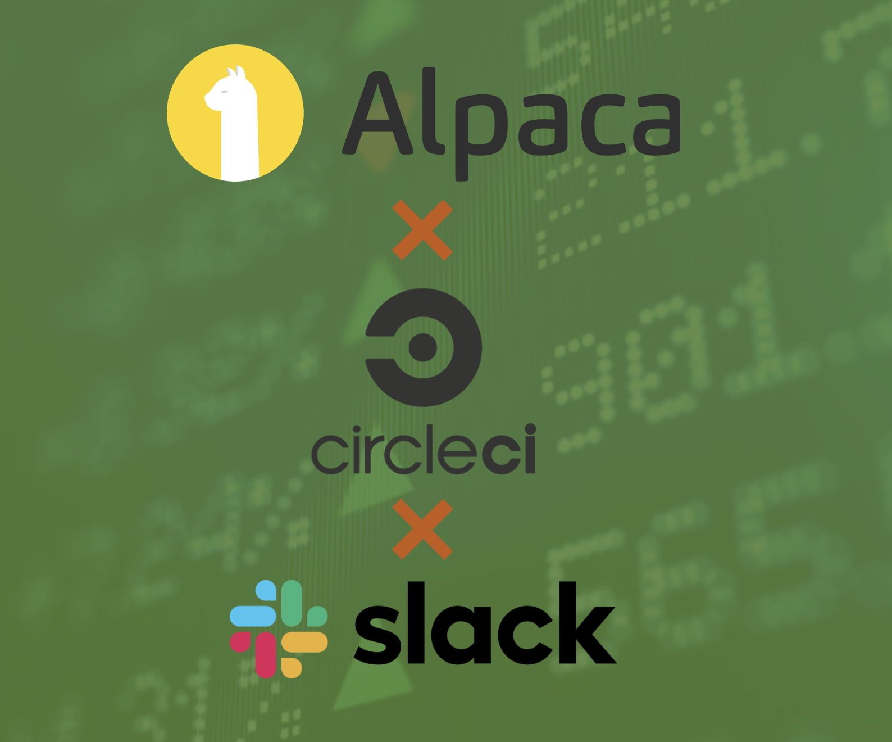

<p align="center">
  
</p>

# Trading Bot with Slack Notifications

This trading bot is designed to automate the process of buying oversold assets and selling overbought assets based on Yahoo Finance data. The bot also sends notifications about recent trades via Slack during specified hours. The project uses the Alpaca API for trading operations and the Yahoo Finance API to identify trading opportunities.

## Project Structure

The project is organized into the following files:

1. `src/trading_classes.py`: Contains the `TradingOpportunities` and `Alpaca` classes, which handle scraping trading opportunities and executing buy/sell orders, respectively.
2. `src/slack_app_notification.py`: Contains the `slack_app_notification()` function, which formats and returns a string containing the trading activity details to be sent via Slack.
3. `main.py`: The main script that brings together the functionality from the `src` folder, executing the trading bot's operations and sending Slack notifications.
4. `creds.cfg`: A configuration file that stores the Alpaca API and Slack API credentials. (Make sure to add your own API keys and tokens here)
5. `.circleci/config.yml`: The CircleCI configuration file that defines jobs, steps, and workflows for automated testing, building, and deployment.

## How It Works

The trading bot performs the following tasks:

1. Scrape trading opportunities from Yahoo Finance using the `TradingOpportunities` class.
2. Filter the scraped assets to identify the ones that meet the buying criteria.
3. Liquidate currently held assets that meet the selling criteria.
4. Execute buy orders for the assets that meet the buying criteria.
5. Send a formatted Slack message containing the trading activity details during specified hours.

The trading bot is scheduled to run at different times of the day using CircleCI, as specified in the `.circleci/config.yml` file.

## Getting Started

1. Clone the repository.
2. Create a virtual environment and activate it:

```console 
python3 -m venv venv 
source venv/bin/activate
```

3. Install the required dependencies:

```console
pip install -r requirements.txt
```

4. Add your Alpaca API and Slack API credentials to the `creds.cfg` file.
5. Run the trading bot:

```console
python main.py
```

## CircleCI Integration

To set up the CircleCI integration for automated testing and deployment, follow these steps:

1. Sign up for a CircleCI account if you don't have one already.
2. Add your GitHub repository to CircleCI.
3. Push the `.circleci/config.yml` file to your repository. CircleCI will automatically detect the file and start running the specified workflows.

## Notes

- Make sure to customize the arguments in the `main()` function in `main.py` based on your preferences (e.g., trading hours, number of stocks and cryptocurrencies to consider, etc.).
- Ensure that your API keys and tokens are kept secure and not exposed publicly.

Happy trading!